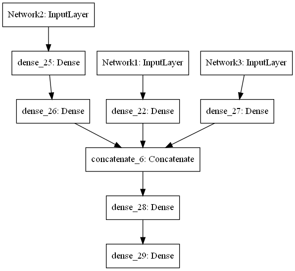
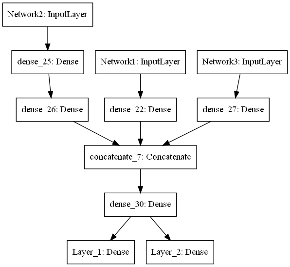

```python
from tensorflow.keras import Model
from tensorflow.keras.layers import Input, Dense, concatenate


```


```python
Network1_INPUT = Input(shape=(4,),name='Network1')
NetModel1 = Dense(8,activation='relu')(Network1_INPUT)
```


```python
Network2_INPUT = Input(shape=(8,),name='Network2')
NetModel2 = Dense(16,activation='relu')(Network2_INPUT)
NetModel2 = Dense(16,activation='relu')(NetModel2)

```


```python
Network3_INPUT = Input(shape=(16,),name='Network3')
NetModel3 = Dense(32,activation='relu')(Network3_INPUT)
```


```python
out = concatenate([NetModel1,NetModel2,NetModel3],axis=-1)
out = Dense(28, activation='relu')(out)
out = Dense(1)(out)
```


```python
model = Model([Network1_INPUT,Network2_INPUT,Network3_INPUT],out)
```


```python
model.summary()
```

    Model: "model_7"
    __________________________________________________________________________________________________
    Layer (type)                    Output Shape         Param #     Connected to                     
    ==================================================================================================
    Network2 (InputLayer)           [(None, 8)]          0                                            
    __________________________________________________________________________________________________
    Network1 (InputLayer)           [(None, 4)]          0                                            
    __________________________________________________________________________________________________
    dense_25 (Dense)                (None, 16)           144         Network2[0][0]                   
    __________________________________________________________________________________________________
    Network3 (InputLayer)           [(None, 16)]         0                                            
    __________________________________________________________________________________________________
    dense_22 (Dense)                (None, 8)            40          Network1[0][0]                   
    __________________________________________________________________________________________________
    dense_26 (Dense)                (None, 16)           272         dense_25[0][0]                   
    __________________________________________________________________________________________________
    dense_27 (Dense)                (None, 32)           544         Network3[0][0]                   
    __________________________________________________________________________________________________
    concatenate_6 (Concatenate)     (None, 56)           0           dense_22[0][0]                   
                                                                     dense_26[0][0]                   
                                                                     dense_27[0][0]                   
    __________________________________________________________________________________________________
    dense_28 (Dense)                (None, 28)           1596        concatenate_6[0][0]              
    __________________________________________________________________________________________________
    dense_29 (Dense)                (None, 1)            29          dense_28[0][0]                   
    ==================================================================================================
    Total params: 2,625
    Trainable params: 2,625
    Non-trainable params: 0
    __________________________________________________________________________________________________
    


```python
from tensorflow.keras.utils import plot_model
plot_model(model,to_file="model.png")
```


    

    


```python
out2 = concatenate([NetModel1,NetModel2,NetModel3],axis=-1)
out2 = Dense(28, activation='relu')(out2)
OutputLayer_1 = Dense(1,name='Layer_1')(out2)
OutputLayer_2 = Dense(3,activation='softmax',name='Layer_2')(out2)


model2 = Model([Network1_INPUT,Network2_INPUT,Network3_INPUT],[OutputLayer_1,OutputLayer_2])
model2.summary()
```

    Model: "model_8"
    __________________________________________________________________________________________________
    Layer (type)                    Output Shape         Param #     Connected to                     
    ==================================================================================================
    Network2 (InputLayer)           [(None, 8)]          0                                            
    __________________________________________________________________________________________________
    Network1 (InputLayer)           [(None, 4)]          0                                            
    __________________________________________________________________________________________________
    dense_25 (Dense)                (None, 16)           144         Network2[0][0]                   
    __________________________________________________________________________________________________
    Network3 (InputLayer)           [(None, 16)]         0                                            
    __________________________________________________________________________________________________
    dense_22 (Dense)                (None, 8)            40          Network1[0][0]                   
    __________________________________________________________________________________________________
    dense_26 (Dense)                (None, 16)           272         dense_25[0][0]                   
    __________________________________________________________________________________________________
    dense_27 (Dense)                (None, 32)           544         Network3[0][0]                   
    __________________________________________________________________________________________________
    concatenate_7 (Concatenate)     (None, 56)           0           dense_22[0][0]                   
                                                                     dense_26[0][0]                   
                                                                     dense_27[0][0]                   
    __________________________________________________________________________________________________
    dense_30 (Dense)                (None, 28)           1596        concatenate_7[0][0]              
    __________________________________________________________________________________________________
    Layer_1 (Dense)                 (None, 1)            29          dense_30[0][0]                   
    __________________________________________________________________________________________________
    Layer_2 (Dense)                 (None, 3)            87          dense_30[0][0]                   
    ==================================================================================================
    Total params: 2,712
    Trainable params: 2,712
    Non-trainable params: 0
    __________________________________________________________________________________________________
    


```python
plot_model(model2,to_file="model2.png")

```


    

    


