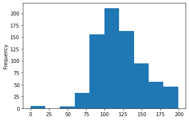
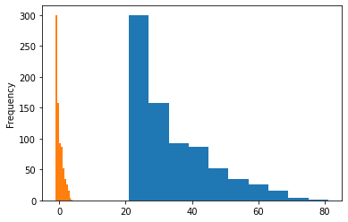

```python
# 數據處理  Pima Indians Diabetes Database  資料集
# 資料來源 ( Kaggle ) https://www.kaggle.com/saurabh00007/diabetescsv
# 儲存在本地相對目錄:  './DataSet/Diabetes/diabetes.csv'

# 讀取資料 
FileName = r'./DataSet/Diabetes/diabetes.csv'
```


```python
# pandas 讀取 CSV 檔
# read_csv 函數

import pandas as pd

df = pd.read_csv(FileName)
print('檢視資料:\n',df.head(n=3),'\n')

# 習慣偏好使用
print('簡易敘述統計:\n',df.describe(),'\n')

print('檢查闕漏值:\n',df.isnull().count(axis=0),'\n')
# 在這裡失敗: 分析原因:遺漏缺失值以數字 0 來表示


print('資料欄位名稱:\n',df.columns,'\n')
# 參考資料: https://zhuanlan.zhihu.com/p/90912671

# glucose、blood_pressure、skin_thick、insulin、BMI 最小数据不应为0，可理解这些数据列没有数据录入，存在数据缺失。处理思路：
# 1.将这些列的0值转换成NaN值；
# 2.根据outcome的结果计算出各列的平均值；
# 3.使用平均值填充缺失值。
#   数据类型都为数值类型。
```

    檢視資料:
        Pregnancies  Glucose  BloodPressure  SkinThickness  Insulin   BMI  \
    0            6      148             72             35        0  33.6   
    1            1       85             66             29        0  26.6   
    2            8      183             64              0        0  23.3   
    
       DiabetesPedigreeFunction  Age  Outcome  
    0                     0.627   50        1  
    1                     0.351   31        0  
    2                     0.672   32        1   
    
    簡易敘述統計:
            Pregnancies     Glucose  BloodPressure  SkinThickness     Insulin  \
    count   768.000000  768.000000     768.000000     768.000000  768.000000   
    mean      3.845052  120.894531      69.105469      20.536458   79.799479   
    std       3.369578   31.972618      19.355807      15.952218  115.244002   
    min       0.000000    0.000000       0.000000       0.000000    0.000000   
    25%       1.000000   99.000000      62.000000       0.000000    0.000000   
    50%       3.000000  117.000000      72.000000      23.000000   30.500000   
    75%       6.000000  140.250000      80.000000      32.000000  127.250000   
    max      17.000000  199.000000     122.000000      99.000000  846.000000   
    
                  BMI  DiabetesPedigreeFunction         Age     Outcome  
    count  768.000000                768.000000  768.000000  768.000000  
    mean    31.992578                  0.471876   33.240885    0.348958  
    std      7.884160                  0.331329   11.760232    0.476951  
    min      0.000000                  0.078000   21.000000    0.000000  
    25%     27.300000                  0.243750   24.000000    0.000000  
    50%     32.000000                  0.372500   29.000000    0.000000  
    75%     36.600000                  0.626250   41.000000    1.000000  
    max     67.100000                  2.420000   81.000000    1.000000   
    
    檢查闕漏值:
     Pregnancies                 768
    Glucose                     768
    BloodPressure               768
    SkinThickness               768
    Insulin                     768
    BMI                         768
    DiabetesPedigreeFunction    768
    Age                         768
    Outcome                     768
    dtype: int64 
    
    資料欄位名稱:
     Index(['Pregnancies', 'Glucose', 'BloodPressure', 'SkinThickness', 'Insulin',
           'BMI', 'DiabetesPedigreeFunction', 'Age', 'Outcome'],
          dtype='object') 
    
    


```python
df2 = df.copy()
import matplotlib.pyplot as plt
```


```python
plt.figure();
df2['BMI'].plot(kind = 'hist')
plt.figure();
df2['BMI'].plot(kind = 'hist')

plt.figure();
df2['BMI'].plot.hist(stacked=True, bins=20,alpha=0.5);
(10+df['BMI']).plot.hist(stacked=False, bins=20,alpha=0.5);

```


    

    


    

    


    

    


```python
plt.figure();
df['BMI'].plot(kind = 'hist')
# 假定平均值數值填值
print(df[df['BMI'] == 0].head())
plt.figure();
df.loc[df['BMI'] == 0,['BMI']] = df['BMI'].mean()

df['BMI'].plot(kind = 'hist')
```

         Pregnancies  Glucose  BloodPressure  SkinThickness  Insulin  BMI  \
    9              8      125             96              0        0  0.0   
    49             7      105              0              0        0  0.0   
    60             2       84              0              0        0  0.0   
    81             2       74              0              0        0  0.0   
    145            0      102             75             23        0  0.0   
    
         DiabetesPedigreeFunction  Age  Outcome  
    9                       0.232   54        1  
    49                      0.305   24        0  
    60                      0.304   21        0  
    81                      0.102   22        0  
    145                     0.572   21        0  
    


    <AxesSubplot:ylabel='Frequency'>


    

    


    

    


```python

```


```python
plt.figure();
df['Insulin'].plot(kind = 'hist')
# 假定平均值數值填值
print(df[df['Insulin'] == 0].head())
df.loc[df['Insulin'] == 0,['Insulin']] = df['Insulin'].mean()
plt.figure();
df['Insulin'].plot(kind = 'hist')
```

       Pregnancies  Glucose  BloodPressure  SkinThickness  Insulin   BMI  \
    0            6      148             72             35        0  33.6   
    1            1       85             66             29        0  26.6   
    2            8      183             64              0        0  23.3   
    5            5      116             74              0        0  25.6   
    7           10      115              0              0        0  35.3   
    
       DiabetesPedigreeFunction  Age  Outcome  
    0                     0.627   50        1  
    1                     0.351   31        0  
    2                     0.672   32        1  
    5                     0.201   30        0  
    7                     0.134   29        0  
    


    <AxesSubplot:ylabel='Frequency'>


    

    


    

    


```python
plt.figure();
df['SkinThickness'].plot(kind = 'hist')
# 假定平均值數值填值
print(df[df['SkinThickness'] == 0.0].head())
df.loc[df['SkinThickness'] == 0.0,['SkinThickness']] = df['SkinThickness'].mean()
plt.figure();
df['SkinThickness'].plot(kind = 'hist')
```

        Pregnancies  Glucose  BloodPressure  SkinThickness    Insulin        BMI  \
    2             8      183             64              0  79.799479  23.300000   
    5             5      116             74              0  79.799479  25.600000   
    7            10      115              0              0  79.799479  35.300000   
    9             8      125             96              0  79.799479  31.992578   
    10            4      110             92              0  79.799479  37.600000   
    
        DiabetesPedigreeFunction  Age  Outcome  
    2                      0.672   32        1  
    5                      0.201   30        0  
    7                      0.134   29        0  
    9                      0.232   54        1  
    10                     0.191   30        0  
    


    <AxesSubplot:ylabel='Frequency'>


    

    


    

    


```python
plt.figure();
df['BloodPressure'].plot(kind = 'hist')
# 假定平均值數值填值
print(df[df['BloodPressure'] == 0.0].head())
df.loc[df['BloodPressure'] == 0.0,['BloodPressure']] = df['BloodPressure'].mean()
plt.figure();
df['BloodPressure'].plot(kind = 'hist')
```

        Pregnancies  Glucose  BloodPressure  SkinThickness    Insulin        BMI  \
    7            10      115              0      20.536458  79.799479  35.300000   
    15            7      100              0      20.536458  79.799479  30.000000   
    49            7      105              0      20.536458  79.799479  31.992578   
    60            2       84              0      20.536458  79.799479  31.992578   
    78            0      131              0      20.536458  79.799479  43.200000   
    
        DiabetesPedigreeFunction  Age  Outcome  
    7                      0.134   29        0  
    15                     0.484   32        1  
    49                     0.305   24        0  
    60                     0.304   21        0  
    78                     0.270   26        1  
    


    <AxesSubplot:ylabel='Frequency'>


    

    


    

    


```python
plt.figure();
df['Glucose'].plot(kind = 'hist')
# 假定平均值數值填值
print(df[df['Glucose'] == 0.0].head())
df.loc[df['Glucose'] == 0.0,['Glucose']] = df['Glucose'].mean()
plt.figure();
df['Glucose'].plot(kind = 'hist')
```

         Pregnancies  Glucose  BloodPressure  SkinThickness    Insulin   BMI  \
    75             1        0           48.0           20.0  79.799479  24.7   
    182            1        0           74.0           20.0  23.000000  27.7   
    342            1        0           68.0           35.0  79.799479  32.0   
    349            5        0           80.0           32.0  79.799479  41.0   
    502            6        0           68.0           41.0  79.799479  39.0   
    
         DiabetesPedigreeFunction  Age  Outcome  
    75                      0.140   22        0  
    182                     0.299   21        0  
    342                     0.389   22        0  
    349                     0.346   37        1  
    502                     0.727   41        1  
    


    <AxesSubplot:ylabel='Frequency'>


    

    


    

    


```python
print('簡易敘述統計:\n',df.describe(),'\n')
```

    簡易敘述統計:
            Pregnancies     Glucose  BloodPressure  SkinThickness     Insulin  \
    count   768.000000  768.000000     768.000000     768.000000  768.000000   
    mean      3.845052  121.681605      72.254807      26.606479  118.660163   
    std       3.369578   30.436016      12.115932       9.631241   93.080358   
    min       0.000000   44.000000      24.000000       7.000000   14.000000   
    25%       1.000000   99.750000      64.000000      20.536458   79.799479   
    50%       3.000000  117.000000      72.000000      23.000000   79.799479   
    75%       6.000000  140.250000      80.000000      32.000000  127.250000   
    max      17.000000  199.000000     122.000000      99.000000  846.000000   
    
                  BMI  DiabetesPedigreeFunction         Age     Outcome  
    count  768.000000                768.000000  768.000000  768.000000  
    mean    32.450805                  0.471876   33.240885    0.348958  
    std      6.875374                  0.331329   11.760232    0.476951  
    min     18.200000                  0.078000   21.000000    0.000000  
    25%     27.500000                  0.243750   24.000000    0.000000  
    50%     32.000000                  0.372500   29.000000    0.000000  
    75%     36.600000                  0.626250   41.000000    1.000000  
    max     67.100000                  2.420000   81.000000    1.000000   
    
    


```python
import tensorflow as tf
from tensorflow.keras import Model
from tensorflow.keras.layers import Input, Dense

```


```python
input_layer = Input((8,),name='Logistic')
out_layer = Dense(1,activation='sigmoid')(input_layer)

LogModel = Model(input_layer,out_layer)
LogModel.summary()
```

    Model: "model"
    _________________________________________________________________
    Layer (type)                 Output Shape              Param #   
    =================================================================
    Logistic (InputLayer)        [(None, 8)]               0         
    _________________________________________________________________
    dense (Dense)                (None, 1)                 9         
    =================================================================
    Total params: 9
    Trainable params: 9
    Non-trainable params: 0
    _________________________________________________________________
    


```python
y = df['Outcome']
x = df.drop(['Outcome'],axis=1)
zscore_x = x.copy()
zscore_x.head()
```


<div>
<style scoped>
    .dataframe tbody tr th:only-of-type {
        vertical-align: middle;
    }

    .dataframe tbody tr th {
        vertical-align: top;
    }

    .dataframe thead th {
        text-align: right;
    }
</style>
<table border="1" class="dataframe">
  <thead>
    <tr style="text-align: right;">
      <th></th>
      <th>Pregnancies</th>
      <th>Glucose</th>
      <th>BloodPressure</th>
      <th>SkinThickness</th>
      <th>Insulin</th>
      <th>BMI</th>
      <th>DiabetesPedigreeFunction</th>
      <th>Age</th>
    </tr>
  </thead>
  <tbody>
    <tr>
      <th>0</th>
      <td>6</td>
      <td>148.0</td>
      <td>72.0</td>
      <td>35.000000</td>
      <td>79.799479</td>
      <td>33.6</td>
      <td>0.627</td>
      <td>50</td>
    </tr>
    <tr>
      <th>1</th>
      <td>1</td>
      <td>85.0</td>
      <td>66.0</td>
      <td>29.000000</td>
      <td>79.799479</td>
      <td>26.6</td>
      <td>0.351</td>
      <td>31</td>
    </tr>
    <tr>
      <th>2</th>
      <td>8</td>
      <td>183.0</td>
      <td>64.0</td>
      <td>20.536458</td>
      <td>79.799479</td>
      <td>23.3</td>
      <td>0.672</td>
      <td>32</td>
    </tr>
    <tr>
      <th>3</th>
      <td>1</td>
      <td>89.0</td>
      <td>66.0</td>
      <td>23.000000</td>
      <td>94.000000</td>
      <td>28.1</td>
      <td>0.167</td>
      <td>21</td>
    </tr>
    <tr>
      <th>4</th>
      <td>0</td>
      <td>137.0</td>
      <td>40.0</td>
      <td>35.000000</td>
      <td>168.000000</td>
      <td>43.1</td>
      <td>2.288</td>
      <td>33</td>
    </tr>
  </tbody>
</table>
</div>


```python
def NormalizedColumn(Data,ColumnName):
    Data[ColumnName].plot(kind = 'hist')
    # 標準化
    Data[ColumnName] = (Data[ColumnName] - Data[ColumnName].mean()) / Data[ColumnName].std()
    Data[ColumnName].plot(kind = 'hist')
```


```python
NormalizedColumn(zscore_x,'Pregnancies')   
```


    

    


```python
NormalizedColumn(zscore_x,'Glucose')
```


    

    


```python
NormalizedColumn(zscore_x,'SkinThickness')    
```


    

    


```python
NormalizedColumn(zscore_x,'Insulin')
```


    

    


```python
NormalizedColumn(zscore_x,'BMI')    
```


    

    


```python
NormalizedColumn(zscore_x,'DiabetesPedigreeFunction')
```


    

    


```python
NormalizedColumn(zscore_x,'BloodPressure')

```


    

    


```python
NormalizedColumn(zscore_x,'Age')
```


    

    


```python
print(zscore_x.head())
print('==============================================')
print(x.head())
```

       Pregnancies   Glucose  BloodPressure  SkinThickness   Insulin       BMI  \
    0     0.639530  0.864712      -0.021031       0.871489 -0.417496  0.167147   
    1    -0.844335 -1.205204      -0.516246       0.248516 -0.417496 -0.850980   
    2     1.233077  2.014666      -0.681318      -0.630243 -0.417496 -1.330954   
    3    -0.844335 -1.073781      -0.516246      -0.374456 -0.264934 -0.632810   
    4    -1.141108  0.503298      -2.662181       0.871489  0.530078  1.548890   
    
       DiabetesPedigreeFunction       Age  
    0                  0.468187  1.425067  
    1                 -0.364823 -0.190548  
    2                  0.604004 -0.105515  
    3                 -0.920163 -1.040871  
    4                  5.481337 -0.020483  
    ==============================================
       Pregnancies  Glucose  BloodPressure  SkinThickness     Insulin   BMI  \
    0            6    148.0           72.0      35.000000   79.799479  33.6   
    1            1     85.0           66.0      29.000000   79.799479  26.6   
    2            8    183.0           64.0      20.536458   79.799479  23.3   
    3            1     89.0           66.0      23.000000   94.000000  28.1   
    4            0    137.0           40.0      35.000000  168.000000  43.1   
    
       DiabetesPedigreeFunction  Age  
    0                     0.627   50  
    1                     0.351   31  
    2                     0.672   32  
    3                     0.167   21  
    4                     2.288   33  
    


```python
# 拆分訓練資料集 及 驗證資料
# import numpy as np
# zscore_x.shape[0]

# testing_index = np.random.randint(zscore_x.shape[0],size=3)
# print(testing_index)
# zscore_x.loc[testing_index]

from sklearn.model_selection import train_test_split
train_x,test_x,train_y,test_y= train_test_split(zscore_x,y,train_size=0.8)

print(train_x.shape)
print(test_x.shape)

print(train_y.shape)
print(test_y.shape)

```

    (614, 8)
    (154, 8)
    (614,)
    (154,)
    


```python
# 訓練網路
#zscore_x
LogModel.compile(optimizer='SGD',loss='binary_crossentropy',metrics=['acc'])
#LogModel.compile(optimizer='SGD',loss='mse',metrics=['binary_accuracy'])
history = LogModel.fit(train_x,train_y, validation_split=0.2, batch_size=100,epochs=100,verbose=0)
history
```


    <tensorflow.python.keras.callbacks.History at 0x1bdb863a7b8>


```python
history.history.keys()
```


    dict_keys(['loss', 'acc', 'val_loss', 'val_acc'])


```python

print(history.history.keys())
# summarize history for accuracy
plt.plot(history.history['acc'])
plt.plot(history.history['val_acc'])
plt.title('model accuracy')
plt.ylabel('accuracy')
plt.xlabel('epoch')
plt.show()
# plt.legend(['train', 'test'], loc='upper left') plt.show()
# summarize history for loss 
plt.plot(history.history['loss']) 
plt.plot(history.history['val_loss']) 
plt.title('model loss')
plt.ylabel('loss')
plt.xlabel('epoch')
plt.show()
# plt.legend(['train', 'test'], loc='upper left') plt.show()
```

    dict_keys(['loss', 'acc', 'val_loss', 'val_acc'])
    


    

    


    

    


```python
print([1 if i else 0  for i in LogModel.predict(test_x)[0:5]>0.5] )
print(test_y[0:5])
```

    [0, 0, 0, 0, 1]
    157    0
    142    0
    423    0
    429    1
    61     1
    Name: Outcome, dtype: int64
    


```python
loss, acc = LogModel.evaluate(test_x,test_y) 
print(acc)
```

    5/5 [==============================] - 0s 3ms/step - loss: 0.5348 - acc: 0.7143
    0.7142857313156128
    


```python
import pickle
import gzip
import joblib
```


```python
LogModel.save('LogModel.h5')
    
```


```python
with gzip.GzipFile('./LogModel.pgz','w') as f:
    pickle.dump(LogModel,f)
```


    ---------------------------------------------------------------------------

    TypeError                                 Traceback (most recent call last)

    <ipython-input-32-3808b19d06af> in <module>
          1 with gzip.GzipFile('./LogModel.pgz','w') as f:
    ----> 2     pickle.dump(LogModel,f)
    

    TypeError: can't pickle weakref objects


```python

```
