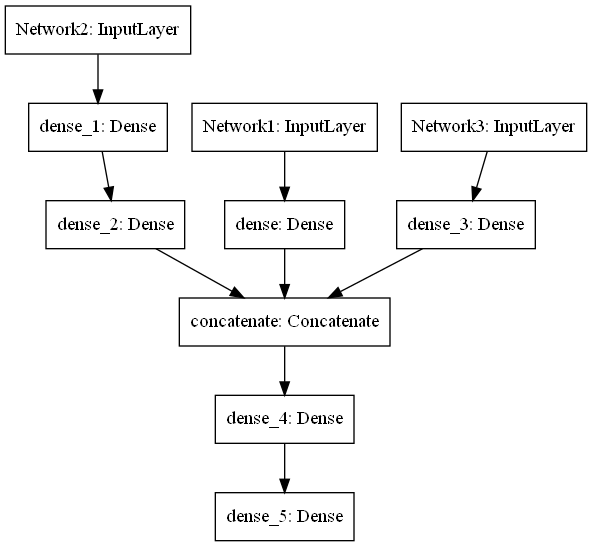
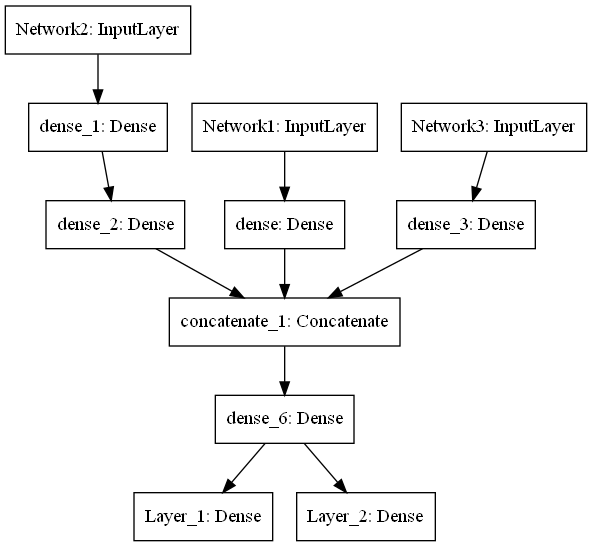

```python
import numpy as np
# 隨機資料產生: 以下數據單存為了驗證程式是否可以運作，沒任何意義
rng = np.random.RandomState(0)

DataCount = 10000
Network1_Data_x = rng.rand(DataCount,4)
Network2_Data_x = rng.rand(DataCount,8)  
Network3_Data_x = rng.rand(DataCount,16) 

# 假設 y 值與特徵有直接的線性關係
y = (np.mean(Network1_Data_x,axis=-1)*4 - np.mean(Network2_Data_x,axis=-1)*8 + np.mean(Network3_Data_x,axis=-1)*16)
```


```python
#搭建合併多輸入單輸出網絡模型 

from tensorflow.keras import Model
from tensorflow.keras.layers import Input, Dense, concatenate

```


```python
Network1_INPUT = Input(shape=(4,),name='Network1')
NetModel1 = Dense(8,activation='relu')(Network1_INPUT)
```


```python
Network2_INPUT = Input(shape=(8,),name='Network2')
NetModel2 = Dense(16,activation='relu')(Network2_INPUT)
NetModel2 = Dense(16,activation='relu')(NetModel2)

```


```python
Network3_INPUT = Input(shape=(16,),name='Network3')
NetModel3 = Dense(32,activation='relu')(Network3_INPUT)
```


```python
out = concatenate([NetModel1,NetModel2,NetModel3],axis=-1)
out = Dense(28, activation='relu')(out)
out = Dense(1)(out)
```


```python
model = Model([Network1_INPUT,Network2_INPUT,Network3_INPUT],out)
```


```python
model.summary()
```

    Model: "model"
    __________________________________________________________________________________________________
    Layer (type)                    Output Shape         Param #     Connected to                     
    ==================================================================================================
    Network2 (InputLayer)           [(None, 8)]          0                                            
    __________________________________________________________________________________________________
    Network1 (InputLayer)           [(None, 4)]          0                                            
    __________________________________________________________________________________________________
    dense_1 (Dense)                 (None, 16)           144         Network2[0][0]                   
    __________________________________________________________________________________________________
    Network3 (InputLayer)           [(None, 16)]         0                                            
    __________________________________________________________________________________________________
    dense (Dense)                   (None, 8)            40          Network1[0][0]                   
    __________________________________________________________________________________________________
    dense_2 (Dense)                 (None, 16)           272         dense_1[0][0]                    
    __________________________________________________________________________________________________
    dense_3 (Dense)                 (None, 32)           544         Network3[0][0]                   
    __________________________________________________________________________________________________
    concatenate (Concatenate)       (None, 56)           0           dense[0][0]                      
                                                                     dense_2[0][0]                    
                                                                     dense_3[0][0]                    
    __________________________________________________________________________________________________
    dense_4 (Dense)                 (None, 28)           1596        concatenate[0][0]                
    __________________________________________________________________________________________________
    dense_5 (Dense)                 (None, 1)            29          dense_4[0][0]                    
    ==================================================================================================
    Total params: 2,625
    Trainable params: 2,625
    Non-trainable params: 0
    __________________________________________________________________________________________________
    


```python
# 畫出網路圖
from tensorflow.keras.utils import plot_model
plot_model(model,to_file="合併多輸入單輸出模型.png")
```


    

    


```python
# 訓練網路
model.compile(optimizer='rmsprop',loss='mse',metrics=['mae'])
```


```python
x1 = Network1_Data_x
x2 = Network2_Data_x
x3 = Network3_Data_x

# 驗證網路搭建是否可以運行，無特別意義
history = model.fit({'Network1':x1 ,'Network2':x2,'Network3':x3},y, validation_split=0.2, batch_size=128,epochs=20,verbose=2)
```

    Epoch 1/20
    63/63 - 1s - loss: 13.5486 - mae: 3.0427 - val_loss: 1.7663 - val_mae: 1.0700
    Epoch 2/20
    63/63 - 0s - loss: 1.4268 - mae: 0.9565 - val_loss: 1.0658 - val_mae: 0.8265
    Epoch 3/20
    63/63 - 0s - loss: 0.8067 - mae: 0.7179 - val_loss: 0.5093 - val_mae: 0.5727
    Epoch 4/20
    63/63 - 0s - loss: 0.3478 - mae: 0.4689 - val_loss: 0.2080 - val_mae: 0.3679
    Epoch 5/20
    63/63 - 0s - loss: 0.1342 - mae: 0.2946 - val_loss: 0.0691 - val_mae: 0.2120
    Epoch 6/20
    63/63 - 0s - loss: 0.0741 - mae: 0.2226 - val_loss: 0.0530 - val_mae: 0.1938
    Epoch 7/20
    63/63 - 0s - loss: 0.0587 - mae: 0.2077 - val_loss: 0.0483 - val_mae: 0.1901
    Epoch 8/20
    63/63 - 0s - loss: 0.0513 - mae: 0.1999 - val_loss: 0.0404 - val_mae: 0.1798
    Epoch 9/20
    63/63 - 0s - loss: 0.0471 - mae: 0.1880 - val_loss: 0.0130 - val_mae: 0.0895
    Epoch 10/20
    63/63 - 0s - loss: 0.0481 - mae: 0.1949 - val_loss: 0.0703 - val_mae: 0.2511
    Epoch 11/20
    63/63 - 0s - loss: 0.0455 - mae: 0.1971 - val_loss: 0.0253 - val_mae: 0.1419
    Epoch 12/20
    63/63 - 0s - loss: 0.0447 - mae: 0.1951 - val_loss: 0.0487 - val_mae: 0.2081
    Epoch 13/20
    63/63 - 0s - loss: 0.0425 - mae: 0.1921 - val_loss: 0.0469 - val_mae: 0.2057
    Epoch 14/20
    63/63 - 0s - loss: 0.0432 - mae: 0.1957 - val_loss: 0.0447 - val_mae: 0.2000
    Epoch 15/20
    63/63 - 0s - loss: 0.0427 - mae: 0.1937 - val_loss: 0.0235 - val_mae: 0.1407
    Epoch 16/20
    63/63 - 0s - loss: 0.0413 - mae: 0.1911 - val_loss: 0.0515 - val_mae: 0.2170
    Epoch 17/20
    63/63 - 0s - loss: 0.0417 - mae: 0.1923 - val_loss: 0.0335 - val_mae: 0.1731
    Epoch 18/20
    63/63 - 0s - loss: 0.0403 - mae: 0.1898 - val_loss: 0.0628 - val_mae: 0.2418
    Epoch 19/20
    63/63 - 0s - loss: 0.0401 - mae: 0.1901 - val_loss: 0.0545 - val_mae: 0.2261
    Epoch 20/20
    63/63 - 0s - loss: 0.0392 - mae: 0.1871 - val_loss: 0.0270 - val_mae: 0.1543
    


```python

```


```python
# 搭建合併多輸入多輸出網絡模型 
out2 = concatenate([NetModel1,NetModel2,NetModel3],axis=-1)
out2 = Dense(28, activation='relu')(out2)
OutputLayer_1 = Dense(1,name='Layer_1')(out2)
OutputLayer_2 = Dense(3,activation='softmax',name='Layer_2')(out2)


model2 = Model([Network1_INPUT,Network2_INPUT,Network3_INPUT],[OutputLayer_1,OutputLayer_2])
model2.summary()
```

    Model: "model_1"
    __________________________________________________________________________________________________
    Layer (type)                    Output Shape         Param #     Connected to                     
    ==================================================================================================
    Network2 (InputLayer)           [(None, 8)]          0                                            
    __________________________________________________________________________________________________
    Network1 (InputLayer)           [(None, 4)]          0                                            
    __________________________________________________________________________________________________
    dense_1 (Dense)                 (None, 16)           144         Network2[0][0]                   
    __________________________________________________________________________________________________
    Network3 (InputLayer)           [(None, 16)]         0                                            
    __________________________________________________________________________________________________
    dense (Dense)                   (None, 8)            40          Network1[0][0]                   
    __________________________________________________________________________________________________
    dense_2 (Dense)                 (None, 16)           272         dense_1[0][0]                    
    __________________________________________________________________________________________________
    dense_3 (Dense)                 (None, 32)           544         Network3[0][0]                   
    __________________________________________________________________________________________________
    concatenate_1 (Concatenate)     (None, 56)           0           dense[0][0]                      
                                                                     dense_2[0][0]                    
                                                                     dense_3[0][0]                    
    __________________________________________________________________________________________________
    dense_6 (Dense)                 (None, 28)           1596        concatenate_1[0][0]              
    __________________________________________________________________________________________________
    Layer_1 (Dense)                 (None, 1)            29          dense_6[0][0]                    
    __________________________________________________________________________________________________
    Layer_2 (Dense)                 (None, 3)            87          dense_6[0][0]                    
    ==================================================================================================
    Total params: 2,712
    Trainable params: 2,712
    Non-trainable params: 0
    __________________________________________________________________________________________________
    


```python
plot_model(model2,to_file="合併多輸入多輸出模型.png")

```


    

    


```python

```
